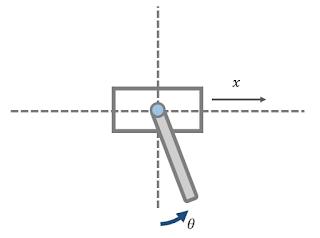
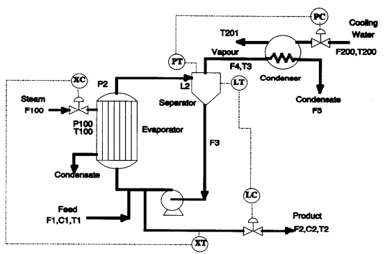

# ClassicGym
OpenAI Gym environments for classic (nonlinear) problems

## Install
```
pip install -e .
```

## Usage

```
import gym
import classic_gym

env = gym.make("cartpole-swingup-v0")
```

## Envs
The environments in this package
- cartpole-swingup-v0

### CartPole Swing up


#### Observation
Type: Box(4)

Num | Observation | Min | Max
---|---|---|---
0 | Cart Position [m] | -10 | 10 
1 | Pole Angle [rad] | - 2&pi;  | 2&pi;
2 | Cart Velocity [m/s] | -10 | 10
3 | Pole Joint Velocity [rad/s] | -10 | 10 

#### Actions
Type: Box(1)

Num | Action | Min | Max
--- | --- | --- | ---
0 | Push cart to the Right [N] | -3. |  3.

#### Reward
Reward is scaled to `[0, 1]`. When obs is `[0., -pi, 0., 0.]`, reward is `1`.

```
Q = diag([0.01, 1., 0.01, 0.1])
x_ref = [0., -pi, 0., 0.]

J = (obs - x_ref).T @ Q @ (obs - x_ref)
out_of_range = is_crashed(obs) # return 1 if obs is out of range

reward = exp(-(J + 100*out_of_range))
```

NOTE: Reward is equivalent as follow at [\[1907\.02057\] Benchmarking Model\-Based Reinforcement Learning](https://arxiv.org/abs/1907.02057)

```
reward = - (x[1]-pi)**2
```

#### Starting State
Uniform random values in the range below. Otherwise zeros.

Num | Observation | Min | Max
---|---|---|---
0 | Cart Position [m] | -1. | 1.
1 | Pole Angle [rad] | - &pi;/6  | &pi;/6

#### Episode Termination
1. Observation states is out of range
2. Episode length is greater than 1200 (60sec in 20Hz)

### Evaporator
Evaporation process modeled in [Control studies on a model evaporation process](https://www.sciencedirect.com/science/article/pii/0959152494800251).



This figure is cited from the paper mentioned above.

#### Observation
Type: Box(2)

Num | Observation | Min | Max
---|---|---|---
0 | Concentration [-] | 0.25 | 1.
1 | Pressure [kPa] | 40  | 80

#### Actions
Type: Box(2)

Num | Action | Min | Max
--- | --- | --- | ---
0 |  Pressure [kPa] | 100 | 400 
1 | Flow Rate [kg/min] | 100 | 400 

#### Episode Termination
1. Observation states is out of range
2. Episode length is greater than 3600 (60min in 1Hz)
