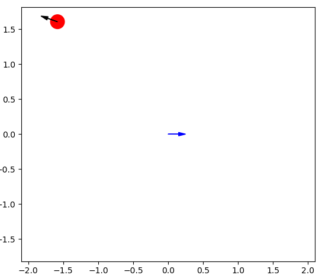

# ClassicGym
OpenAI Gym environments for classic (nonlinear) problems

## Install
```
pip install -e .
```

## Usage

```
import gym
import classic_gym

env = gym.make("cartpole-swingup-v0")
```

## Envs
Environments in this package

|Environment Id|Observation Space|Action Space|Reward Range|Episode length|
|---|---|---|---|---|
| [cartpole-swingup-v0](https://github.com/Chachay/ClassicGym/wiki/Cart-Pole)|Box(4,)|Box(1)|(0, 1)|1200|
| [evaporator-v0](https://github.com/Chachay/ClassicGym/wiki/Evaporator)|Box(2,)|Box(2)|Not checked|1200|
| [mobile-v0](https://github.com/Chachay/ClassicGym/wiki/Mobile-Robot)|Box(3,)|Box(2)|Not checked|1200|

### CartPole Swing up


### Evaporator
Evaporation process modeled in [Control studies on a model evaporation process](https://www.sciencedirect.com/science/article/pii/0959152494800251).


This figure is cited from the paper mentioned above.

### Mobile Robot
Roomba like mobile robot


